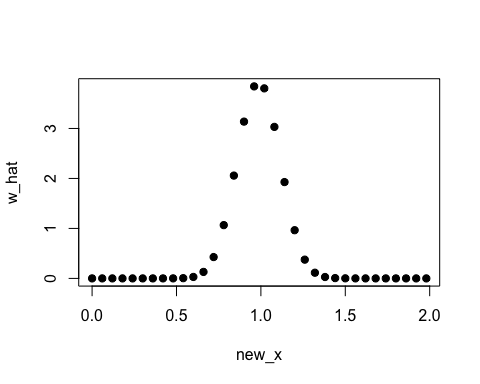

<!-- README.md is generated from README.Rmd. Please edit that file -->

# An R Package for Density Ratio Estimation

#### *Koji MAKIYAMA (@hoxo\_m)*

<!-- badges: start -->

[](https://travis-ci.org/hoxo-m/densratio)
[](https://CRAN.R-project.org/package=densratio)
[](http://cranlogs.r-pkg.org/badges/densratio/)
[](https://coveralls.io/github/hoxo-m/densratio?branch=master)
[](https://saythanks.io/to/hoxo-m)
<!-- badges: end -->

## 1\. Overview

**Density ratio estimation** is described as follows: for given two data
samples `x` and `y` from unknown distributions `p(x)` and `q(y)`
respectively, estimate `w(x) = p(x) / q(x)`, where `x` and `y` are
d-dimensional real numbers.

The estimated density ratio function `w(x)` can be used in many
applications such as **anomaly detection** \[Hido et al. 2011\],
**changepoint detection** \[Liu et al. 2013\], and **covariate shift
adaptation** \[Sugiyama et al. 2007\]. Other useful applications about
density ratio estimation were summarized by \[Sugiyama et al. 2012\].

The package **densratio** provides a function `densratio()`. The
function outputs an object that has a function to estimate density
ratio.

For example,

``` r
set.seed(3)
x <- rnorm(200, mean = 1, sd = 1/8)
y <- rnorm(200, mean = 1, sd = 1/2)

library(densratio)
result <- densratio(x, y)
```

The function `densratio()` estimates the density ratio of `p(x)` to
`q(y)`, `w(x) = p(x)/q(y) = Norm(1, 1/8) / Norm(1, 1/2)`, and provides a
function to compute estimated density ratio. The result object has a
function `compute_density_ratio()` that can compute the estimated
density ratio `w_hat(x)` for any d-dimensional input `x` (now d=1).

``` r
new_x <- seq(0, 2, by = 0.06)
w_hat <- result$compute_density_ratio(new_x)

plot(new_x, w_hat, pch=19)
```

<!-- -->

In this case, the true density ratio `w(x) = p(x)/q(y) = Norm(1, 1/8) /
Norm(1, 1/2)` can be computed precisely. So we can compare `w(x)` with
the estimated density ratio `w_hat(x)`.

``` r
true_density_ratio <- function(x) dnorm(x, 1, 1/8) / dnorm(x, 1, 1/2)

plot(true_density_ratio, xlim=c(-1, 3), lwd=2, col="red", xlab = "x", ylab = "Density Ratio")
plot(result$compute_density_ratio, xlim=c(-1, 3), lwd=2, col="green", add=TRUE)
legend("topright", legend=c(expression(w(x)), expression(hat(w)(x))), col=2:3, lty=1, lwd=2, pch=NA)
```

<!-- -->

## 2\. Installation

You can install the **densratio** package from
[CRAN](https://CRAN.R-project.org/package=densratio).

``` r
install.packages("densratio")
```

You can also install the package from
[GitHub](https://github.com/hoxo-m/densratio).

``` r
install.packages("devtools") # if you have not installed "devtools" package
devtools::install_github("hoxo-m/densratio")
```

The source code for **densratio** package is available on GitHub at

  - <https://github.com/hoxo-m/densratio>.

## 3\. Details

`densratio()` has `method` argument that you can pass `"uLSIF"`,
`"RuSLIF"`, or `"KLIEP"`.

  - **uLSIF** (unconstrained Least-Squares Importance Fitting) is the
    default method. This algorithm estimates density ratio by minimizing
    the squared loss. You can find more information in \[Kanamori et
    al. 2009\] and \[Hido et al. 2011\].

  - **RuLSIF** (Relative unconstrained Least-Squares Importance
    Fitting). This algorithm estimates relative density ratio by
    minimizing the squared loss. You can find more information in
    \[Yamada et al. 2011\] and \[Liu et al. 2013\].

  - **KLIEP** (Kullback-Leibler Importance Estimation Procedure). This
    algorithm estimates density ratio by minimizing Kullback-Leibler
    divergence. You can find more information in \[Sugiyama et
    al. 2007\].

There is a vignette for the package. For more detail, read it.

``` r
vignette("densratio")
```

You can also find it on CRAN.

  - [An R Package for Density Ratio
    Estimation](https://CRAN.R-project.org/package=densratio/vignettes/densratio.html)

## 4\. Related work

We have also developed a Python package for density ratio estimation.

  - <https://github.com/hoxo-m/densratio_py>

The package is available on PyPI (Python Package Index).

  - <https://pypi.python.org/pypi/densratio>

## 5\. References

  - Hido, S., Y. Tsuboi, H. Kashima, M. Sugiyama, and T. Kanamori.
    **Statistical outlier detection using direct density ratio
    estimation.** Knowledge and Information Systems, 2011.
  - Kanamori, T., S. Hido, and M. Sugiyama. **A least-squares approach
    to direct importance estimation.** Journal of Machine Learning
    Research, 2009.
  - Liu, S., M. Yamada, N. Collier, M. Sugiyama. **Change-point
    detection in time-series data by relative density-ratio
    estimation.** Neural Net, 2013
  - Sugiyama, M., S. Nakajima, H. Kashima, P. von Bünau, and M.
    Kawanabe. **Direct importance estimation with model selection and
    its application to covariate shift adaptation.** NIPS 2007.
  - Sugiyama, M., T. Suzuki, and T. Kanamori. **Density ratio estimation
    in machine learning.** Cambridge University Press, 2012.
  - Yamada, M., T. Suzuki, T. Kanamori, H. Hachiya, and M. Sugiyama.
    **Relative density-ratio estimation for robust distribution
    comparison.** NIPS 2011.
