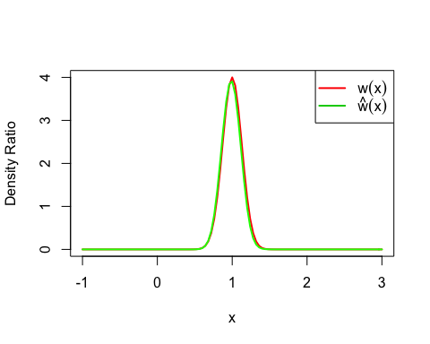

<!-- README.md is generated from README.Rmd. Please edit that file -->


[](https://travis-ci.org/hoxo-m/densratio)
[](http://cran.rstudio.com/web/packages/densratio)
[](http://cranlogs.r-pkg.org/badges/densratio)
[](https://coveralls.io/github/hoxo-m/densratio?branch=master)

## 1. Overview

**Density ratio estimation** is described as follows: for given two data samples `x` and `y` from unknown distributions `p(x)` and `q(y)` respectively, estimate `w(x) = p(x) / q(x)`, where `x` and `y` are d-dimensional real numbers.

The estimated density ratio function `w(x)` can be used in many applications such as **anomaly detection** [1] and **covariate shift adaptation** [2].
Other useful applications about density ratio estimation were summarized by Sugiyama et al. (2012) [3].

The package **densratio** provides a function `densratio()`.
The function outputs an object that has a function to estimate density ratio.

For example, 


```r
set.seed(3)
x <- rnorm(200, mean = 1, sd = 1/8)
y <- rnorm(200, mean = 1, sd = 1/2)

library(densratio)
result <- densratio(x, y)
```

The function `densratio()` estimates the density ratio of `p(x)` to `q(y)`, `w(x) = p(x)/q(y) = Norm(1, 1/8) / Norm(1, 1/2)`, and provides a function to compute estimated density ratio. 
The result object has a function `compute_density_ratio()` that can compute the estimated density ratio `w_hat(x)` for any d-dimensional input `x` (now d=1).


```r
new_x <- seq(0, 2, by = 0.06)
w_hat <- result$compute_density_ratio(new_x)

plot(new_x, w_hat, pch=19)
```

<!-- -->

In this case, the true density ratio `w(x) = p(x)/q(y) = Norm(1, 1/8) / Norm(1, 1/2)` can be computed precisely. 
So we can compare `w(x)` with the estimated density ratio `w_hat(x)`.


```r
true_density_ratio <- function(x) dnorm(x, 1, 1/8) / dnorm(x, 1, 1/2)

plot(true_density_ratio, xlim=c(-1, 3), lwd=2, col="red", xlab = "x", ylab = "Density Ratio")
plot(result$compute_density_ratio, xlim=c(-1, 3), lwd=2, col="green", add=TRUE)
legend("topright", legend=c(expression(w(x)), expression(hat(w)(x))), col=2:3, lty=1, lwd=2, pch=NA)
```

<!-- -->

## 2. Installation

You can install the **densratio** package from [CRAN](https://cran.r-project.org/web/packages/densratio/index.html).


```r
install.packages("densratio")
```

You can also install the package from [GitHub](https://github.com/hoxo-m/densratio).


```r
install.packages("devtools") # if you have not installed "devtools" package
devtools::install_github("hoxo-m/densratio")
```

The source code for **densratio** package is available on GitHub at

- https://github.com/hoxo-m/densratio.

## 3. Details

`densratio()` has `method` argument that you can pass `"uLSIF"` or `"KLIEP"`.

- **uLSIF** (unconstrained Least-Squares Importance Fitting) is the default method.
This algorithm estimates density ratio by minimizing the squared loss.
You can find more information in Hido et al. (2011) [1].

- **KLIEP** (Kullback-Leibler Importance Estimation Procedure) is the another method.
This algorithm estimates density ratio by minimizing Kullback-Leibler divergence.
You can find more information in Sugiyama et al. (2007) [2].

There is a vignette for the package. For more detail, read it.


```r
vignette("densratio")
```

You can also find it on CRAN.

- [An R Package for Density Ratio Estimation](https://cran.r-project.org/web/packages/densratio/vignettes/densratio.html)

## 4. Related work

We have also developed a Python package for density ratio estimation.

- https://github.com/hoxo-m/densratio_py

The package is available on PyPI (Python Package Index).

- https://pypi.python.org/pypi/densratio

## 5. References

[1] Hido, S., Tsuboi, Y., Kashima, H., Sugiyama, M., & Kanamori, T. 
**Statistical outlier detection using direct density ratio estimation.**
Knowledge and Information Systems 2011. 

[2] Sugiyama, M., Nakajima, S., Kashima, H., von Bünau, P. & Kawanabe, M. 
**Direct importance estimation with model selection and its application to covariate shift adaptation.** NIPS 2007.

[3] Sugiyama, M., Suzuki, T. & Kanamori, T. 
**Density Ratio Estimation in Machine Learning.**
Cambridge University Press 2012.
